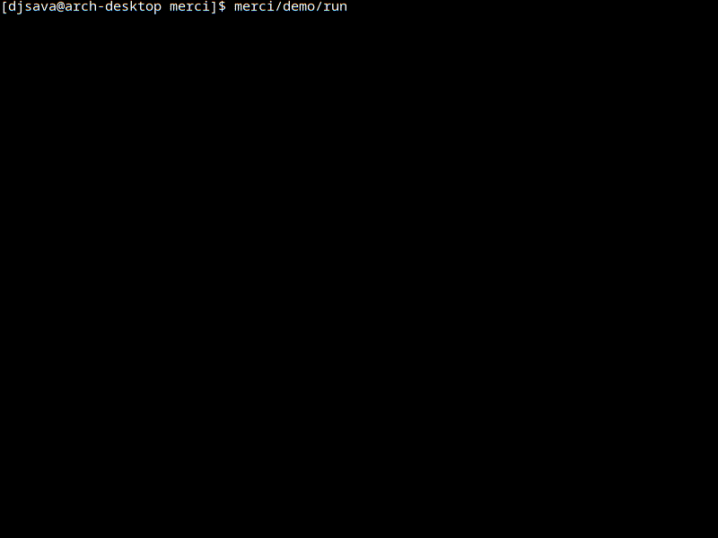

MERCI
===
Migration Engine for Referenced Composite Identifiers


## Description

MERCI tracks and maintains references to composite identifiers used to associate application-level entities with records in a database.

A composite identifier can be derived from several attributes of an application entity, such as an HTTP route, a data schema, and a field. MERCI detects changes to these identifiers during database migrations and updates the corresponding references.

This makes it possible to change application identifiers without losing the database records that reference them, and to propagate these changes consistently across different environments without synchronizing their databases. MERCI also provides an interactive console for resolving ambiguous or conflicting migrations.

## Example

Suppose an application defines two routes:

- `GET /user`
- `POST /user`

Both routes use the `User` data schema. The `User.birth_date` field can only be read or modified by users with the `admin` role.

Individual access rules can be implemented directly in application code. However, when the same kind of rules must be defined across hundreds or thousands of schemas and fields, this leads to significant boilerplate and makes the rules difficult to manage consistently.

Instead, the application can associate each rule with a composite identifier and store the corresponding references in the database. This also makes it possible to change access-control rules without modifying application code.

Now suppose the application changes:

- the `User.birthday` field is renamed to `User.birth_date`;
- the `GET /user` route is renamed to `GET /profile`.

The corresponding composite identifiers have changed. Without migration support, database records referencing the old identifiers would become stale and could no longer be associated with the updated application entities. MERCI detects these changes and records the required identifier migrations in the database.

## Usage (see demo)
```
# create database
createdb merci-demo

# check database connection configuration
cat merci/demo/cfg

# install local environment and fill database
merci/demo/run

# change identifier
sed -i 's/birthday/birth_date/g' merci/demo/app/shapes.py

# launch app to see what happens
merci/demo/run

# make and apply migration
merci/demo/run revision --autogenerate
merci/demo/run upgrade head
```

**Important**
You must set `mapping_migration_model` and `process_revision_directives` in the Alembic context (see `merci/demo/app/config.py`)

## Preview


## Notes
- Advisory locking currently uses PostgreSQL (pg_try_advisory_lock). Other database engines can be supported by overriding IdentifierMapper.acquire().

## Roadmap
- Make composite identifier definitions configurable.
- Generalize binding context beyond route-specific mappings.
- Document the migration algorithm
- Support multiple independent `IdentifierMapper` instances within a single project.
- Support advisory locking on additional SQLAlchemy dialects.
